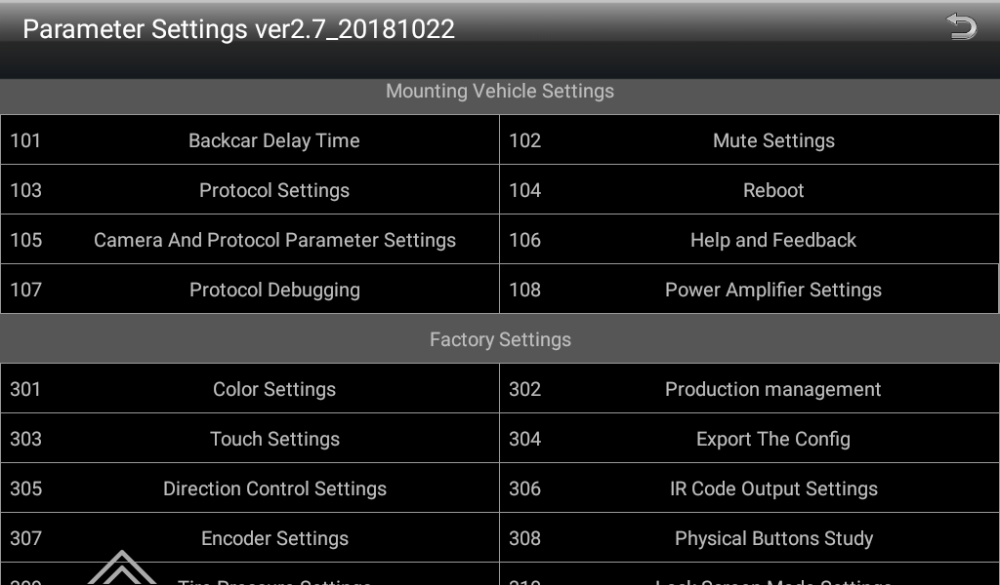
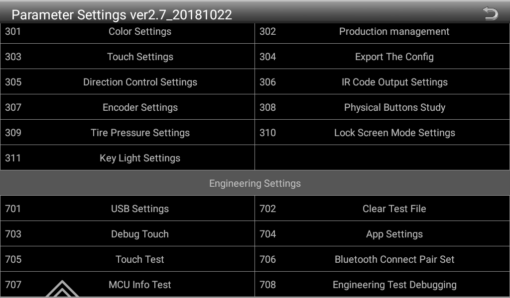

# MTK 8227L Factory Settings Documentation

## Overview

This repository documents the factory settings menu for MTK 8227L-based Android car head units, specifically the **Parameter Settings ver2.7_20181022** firmware version.

## Firmware Information

- **Version**: 2.7_20181022
- **Build Date**: October 22, 2018
- **Chipset**: MediaTek (MTK) 8227L
- **Platform**: Android (various versions 6-10)

## Menu Structure

The factory settings menu uses a numerical categorization system:

- **100 series**: Mounting Vehicle Settings
- **300 series**: Factory Settings (Parameter Settings)
- **700 series**: Engineering Settings

## Menu Categories

### Mounting Vehicle Settings (100 series)
Vehicle-specific configuration and integration settings.

### Factory Settings (300 series)
Hardware calibration and production settings typically used during manufacturing.

### Engineering Settings (700 series)
Developer and diagnostic tools for testing and debugging.

## Screenshots

## Access

Factory settings are typically accessed via:
- Car Settings → Factory Settings
- Password: **8888** (common for 8227L units)

Additional PIN codes:
- **5678**: Custom boot logo
- **1414**: Reboot and save settings
- **1111**: Memory status
- **5555**: Export settings to SD/USB
- **1616**: Display calibration

## Documentation Status

This is an ongoing research project to document all menu entries and their functions. See [MENU-REFERENCE.md](MENU-REFERENCE.md) for detailed information about each menu item.

## Contributing

If you have information about any of these menu entries or experience with MTK 8227L head units, contributions are welcome.

## Resources

- [XDA Forums - 8227L Discussion](https://xdaforums.com/t/8227l-android-unit-8-1-chinese.3905535/)
- [XDA Forums - Factory Settings Access](https://xdaforums.com/t/how-to-access-engineering-mode-for-ac8227l.4592425/)
- [XDA Forums - PIN Codes](https://xdaforums.com/t/alps-ff5000-other-headunits-8227l-pin-codes-for-factory-menus.4269431/)

## Warning

⚠️ **CAUTION**: Modifying factory settings can potentially brick your device or cause unexpected behavior. Always backup your configuration before making changes.
